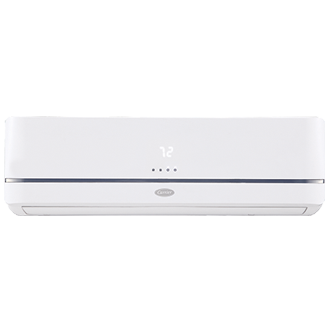

## Ductless Split Systems

To ensure a totally comfortable experience, the Carrier ® Comfort ™ Series EEZ ™ Duct-Free High Wall Split System automatically responds to changes in room temperature. At the same time, it’s an economical choice for heating and cooling comfort with several money-saving features:

- Enjoy comfort only during the times you are using the space and without conditioning the entire home or office
- Leave the system off while you’re away and have it turn on for comfort when you return with the automatic timers
- For additional money-saving efficiency, the sleep mode automatically adjusts your set points and fan speed at night
- No duct work required

Quiet, efficient, and backed by the innovative leader in indoor comfort systems, a Carrier EEZ Duct-Free High Wall Split System is a great choice for your unique heating and cooling needs.

